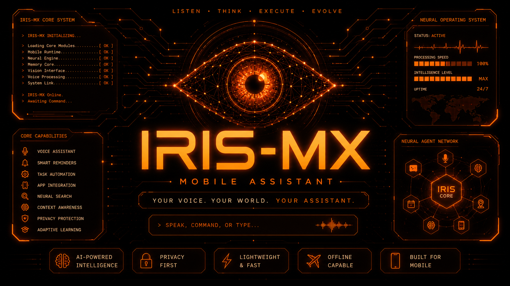

<div align="center">



### Voice-First Mobile AI Execution System

**Speak naturally. Control your Mobile Device. Automate Workflows on Android with Voice Commands.**

---

<div style="display: flex; justify-content: center; gap: 10px; margin-bottom: 20px;">

  <a href="https://github.com/IRISX-AI/IRIS-X/stargazers">
    
  </a>

  <a href="https://github.com/IRISX-AI/IRIS-X/network/members">
    
  </a>

  <a href="https://github.com/IRISX-AI/IRIS-X/graphs/contributors">
    
  </a>

  <a href="https://www.irisxai.in/download/mobile">
    
  </a>

  <a href="https://www.irisxai.in/pricing/iris-mx">
    
  </a>

</div>

**Speak your command. IRIS-MX executes it directly on your phone.**

A voice-first mobile execution assistant powered by **Gemini 3.1 Live API** with real-time bidirectional audio, floating system overlays, native app intents, and hardware automation.

---

</div>

# 📑 Table of Contents

- [⚡ Overview](#-overview)
- [🎯 What is Voice-First Mobile?](#-what-is-voice-first-mobile)
- [✨ Core Mobile Capabilities](#-core-mobile-capabilities)
- [🪡 Open Core Model & Code Protection](#-open-core-model--code-protection)
- [💰 Pricing & Licensing](#-pricing--licensing)
- [🚀 Download & Setup](#-download--setup)
- [📁 Project Structure](#-project-structure)
- [🤝 Contributing](#-contributing)
- [🔒 Security & Privacy](#-security--privacy)
- [👨‍💻 Architect & Contact](#-architect--contact)
- [📜 License](#-license)

---

# ⚡ Overview

IRIS-MX is not a basic chatbot.

It is a **Voice-First Mobile AI Assistant** built on the powerful IRIS-AI Voice Engine. It listens to your spoken commands in real-time and executes real actions directly across your phone—opening apps, playing music, sending WhatsApp messages, making calls, controlling hardware settings, and managing device tasks.

> **Speak naturally. IRIS-MX understands intent. Actions happen live on your mobile device.**

---

# 🎯 What is Voice-First Mobile?

Traditional phone apps force you to unlock your screen, find an icon, tap buttons, and type text.

IRIS-MX changes that completely: **You speak → IRIS hears you in real time → Actions execute on your phone.**

```
Your Spoken Voice
    ↓ (Bidirectional Real-Time PCM Stream)
Gemini 3.1 Live API
    ↓ (Intent & Action Recognition)
IRIS Mobile Execution Engine
    ↓ (Native Intents & Hardware APIs)
WhatsApp / Spotify / Calls / Settings / Camera / Overlays
```

- **Latency:** Sub-second zero-latency bidirectional voice streams.
- **Background Resilient:** Runs via floating system overlays and background service loops.
- **Multimodal Screen Streaming:** Real-time screen capture streaming directly to the AI for visual context.

---

# ✨ Core Mobile Capabilities

### 💬 WhatsApp & Direct Communication

- **Send WhatsApp Messages:** Compose and launch direct WhatsApp messages to any contact by name.
  - _Commands:_ "Send a WhatsApp message to Sidhu saying I'm on my way", "Message Mom on WhatsApp"
- **Phone Calls & SMS:** Search device contacts and trigger calls or text messages instantly.
  - _Commands:_ "Call Alex", "Send an SMS to Rahul saying call me back"

### 🎵 Deep Link App Launching & Media Controls

- **YouTube Playback:** Search and play any song or video on YouTube instantly.
  - _Commands:_ "Play Believer on YouTube", "Open YouTube and search podcast"
- **Spotify Streaming:** Trigger native Spotify music streaming for songs, artists, or playlists.
  - _Commands:_ "Play synthwave on Spotify", "Resume Spotify music"
- **Open Any App:** Launch any native mobile application installed on your device.
  - _Commands:_ "Open Settings", "Launch Instagram", "Open Chrome"

### ⚡ Hardware & System Controls

- **Flashlight Control:** Instantly toggle your device's LED flashlight on or off.
  - _Commands:_ "Turn on flashlight", "Turn off flashlight"
- **System Settings Teleport:** Direct navigation to Wi-Fi, Bluetooth, Location, and Hotspot control panels.
  - _Commands:_ "Open Wi-Fi settings", "Turn on Bluetooth settings"

### 📅 Calendar & Memory Management

- **Calendar Scheduling:** Check upcoming events and create new meetings in your device calendar.
  - _Commands:_ "What's on my calendar for today?", "Schedule a meeting for tomorrow at 3 PM"
- **Persistent AI Memory:** Remember important user facts, preferences, and notes across sessions.
  - _Commands:_ "Remember my car parking spot is level 2", "What is my car parking spot?"

### 👁️ Multimodal Screen Vision & Floating Overlay

- **Real-Time Screen Capture:** Stream your live mobile screen directly to IRIS to ask questions about anything displayed.
  - _Commands:_ "Look at my screen and summarize this article", "What code error is showing on screen?"
- **Floating System Dock:** A glassmorphic quick-dock allowing instant voice mute, screen vision toggle, and status monitoring.

---

# 🪡 Open Core Model & Code Protection

IRIS-MX is built on an **Open Core commercial model**:

- **Public Repository ([IRIS-X](https://github.com/IRISX-AI/IRIS-X))**: Contains the user interface shell, navigation layout, theme system, and community integration examples.
- **Private Production Core**: The core native voice execution engine, low-latency PCM audio stream pipelines, and proprietary background automation logic are protected and private.

> 🔒 **IRIS-MX is a paid software.** The public repository allows developers to inspect the UI shell, but full AI execution requires an active **Mobile PRO License**.

---

# 💰 Pricing & Licensing

To use the full IRIS-MX Mobile AI Voice Assistant, you must activate a **Mobile PRO License**.

- 💳 **Purchase Mobile PRO License:** [https://www.irisxai.in/pricing/iris-mx](https://www.irisxai.in/pricing/iris-mx)
- 📲 **Download Official Mobile APK:** [https://www.irisxai.in/download/mobile](https://www.irisxai.in/download/mobile)

_License activation is tied to your account and grants full access to native voice execution, background overlay permissions, and real-time screen streaming._

---

# 🚀 Download & Setup

### 📲 For Mobile App Users

1. Download the official release APK directly from: [https://www.irisxai.in/download/mobile](https://www.irisxai.in/download/mobile)
2. Install the APK on your Android device.
3. Open IRIS-MX, sign in, and grant the required **Microphone** and **Display Over Other Apps** permissions.
4. Enter your Gemini API Key in Settings and tap **Start AI**!

### 💻 For Developers (UI Shell)

To run and inspect the public frontend shell locally:

```bash
# 1. Clone the public repository
git clone https://github.com/IRISX-AI/IRIS-X.git
cd IRIS-X

# 2. Install dependencies
npm install

# 3. Start Expo development server
npm run start
```

---

# 📁 Project Structure

# Project Structure

# Project Structure

# Project Structure

```
IRIS-MX/
├── android
│   ├── app
│   │   ├── build
│   │   │   ├── generated
│   │   │   │   ├── ap_generated_sources
│   │   │   │   │   └── debug
│   │   │   │   ├── autolinking
│   │   │   │   │   └── src
│   │   │   │   ├── res
│   │   │   │   │   ├── pngs
│   │   │   │   │   └── resValues
│   │   │   │   └── source
│   │   │   │       └── buildConfig
│   │   │   ├── intermediates
│   │   │   │   ├── aar_metadata_check
│   │   │   │   │   └── debug
│   │   │   │   ├── annotation_processor_list
│   │   │   │   │   └── debug
│   │   │   │   ├── apk_ide_redirect_file
│   │   │   │   │   └── debug
│   │   │   │   ├── app_metadata
│   │   │   │   │   └── debug
│   │   │   │   ├── assets
│   │   │   │   │   └── debug
│   │   │   │   ├── compatible_screen_manifest
│   │   │   │   │   └── debug
│   │   │   │   ├── compile_and_runtime_not_namespaced_r_class_jar
│   │   │   │   │   └── debug
│   │   │   │   ├── compressed_assets
│   │   │   │   │   └── debug
│   │   │   │   ├── cxx
│   │   │   │   │   ├── Debug
│   │   │   │   │   └── refs
│   │   │   │   ├── data_binding_layout_info_type_merge
│   │   │   │   │   └── debug
│   │   │   │   ├── data_binding_layout_info_type_package
│   │   │   │   │   └── debug
│   │   │   │   ├── desugar_graph
│   │   │   │   │   └── debug
│   │   │   │   ├── dex
│   │   │   │   │   └── debug
│   │   │   │   ├── dex_archive_input_jar_hashes
│   │   │   │   │   └── debug
│   │   │   │   ├── dex_number_of_buckets_file
│   │   │   │   │   └── debug
│   │   │   │   ├── duplicate_classes_check
│   │   │   │   │   └── debug
│   │   │   │   ├── external_file_lib_dex_archives
│   │   │   │   │   └── debug
│   │   │   │   ├── external_libs_dex_archive
│   │   │   │   │   └── debug
│   │   │   │   ├── external_libs_dex_archive_with_artifact_transforms
│   │   │   │   │   └── debug
│   │   │   │   ├── global_synthetics_dex
│   │   │   │   │   └── debug
│   │   │   │   ├── global_synthetics_external_lib
│   │   │   │   │   └── debug
│   │   │   │   ├── global_synthetics_external_libs_artifact_transform
│   │   │   │   │   └── debug
│   │   │   │   ├── global_synthetics_file_lib
│   │   │   │   │   └── debug
│   │   │   │   ├── global_synthetics_mixed_scope
│   │   │   │   │   └── debug
│   │   │   │   ├── global_synthetics_project
│   │   │   │   │   └── debug
│   │   │   │   ├── global_synthetics_subproject
│   │   │   │   │   └── debug
│   │   │   │   ├── incremental
│   │   │   │   │   ├── debug
│   │   │   │   │   ├── debug-mergeJavaRes
│   │   │   │   │   ├── mergeDebugAssets
│   │   │   │   │   ├── mergeDebugJniLibFolders
│   │   │   │   │   ├── mergeDebugShaders
│   │   │   │   │   └── packageDebug
│   │   │   │   ├── java_res
│   │   │   │   │   └── debug
│   │   │   │   ├── javac
│   │   │   │   │   └── debug
│   │   │   │   ├── linked_resources_binary_format
│   │   │   │   │   └── debug
│   │   │   │   ├── local_only_symbol_list
│   │   │   │   │   └── debug
│   │   │   │   ├── manifest_merge_blame_file
│   │   │   │   │   └── debug
│   │   │   │   ├── merged_java_res
│   │   │   │   │   └── debug
│   │   │   │   ├── merged_jni_libs
│   │   │   │   │   └── debug
│   │   │   │   ├── merged_manifest
│   │   │   │   │   └── debug
│   │   │   │   ├── merged_manifests
│   │   │   │   │   └── debug
│   │   │   │   ├── merged_native_libs
│   │   │   │   │   └── debug
│   │   │   │   ├── merged_res
│   │   │   │   │   └── debug
│   │   │   │   ├── merged_res_blame_folder
│   │   │   │   │   └── debug
│   │   │   │   ├── merged_shaders
│   │   │   │   │   └── debug
│   │   │   │   ├── merged_test_only_native_libs
│   │   │   │   │   └── debug
│   │   │   │   ├── mixed_scope_dex_archive
│   │   │   │   │   └── debug
│   │   │   │   ├── navigation_json
│   │   │   │   │   └── debug
│   │   │   │   ├── nested_resources_validation_report
│   │   │   │   │   └── debug
│   │   │   │   ├── packaged_manifests
│   │   │   │   │   └── debug
│   │   │   │   ├── packaged_res
│   │   │   │   │   └── debug
│   │   │   │   ├── project_dex_archive
│   │   │   │   │   └── debug
│   │   │   │   ├── runtime_symbol_list
│   │   │   │   │   └── debug
│   │   │   │   ├── signing_config_versions
│   │   │   │   │   └── debug
│   │   │   │   ├── source_set_path_map
│   │   │   │   │   └── debug
│   │   │   │   ├── stable_resource_ids_file
│   │   │   │   │   └── debug
│   │   │   │   ├── stripped_native_libs
│   │   │   │   │   └── debug
│   │   │   │   ├── sub_project_dex_archive
│   │   │   │   │   └── debug
│   │   │   │   ├── symbol_list_with_package_name
│   │   │   │   │   └── debug
│   │   │   │   └── validate_signing_config
│   │   │   │       └── debug
│   │   │   ├── kotlin
│   │   │   │   └── compileDebugKotlin
│   │   │   │       ├── cacheable
│   │   │   │       ├── classpath-snapshot
│   │   │   │       └── local-state
│   │   │   ├── outputs
│   │   │   │   ├── apk
│   │   │   │   │   └── debug
│   │   │   │   └── logs
│   │   │   │       └── manifest-merger-debug-report.txt
│   │   │   └── tmp
│   │   │       ├── compileDebugJavaWithJavac
│   │   │       │   ├── compileTransaction
│   │   │       │   └── previous-compilation-data.bin
│   │   │       └── kotlin-classes
│   │   │           └── debug
│   │   ├── src
│   │   │   ├── debug
│   │   │   │   └── AndroidManifest.xml
│   │   │   ├── debugOptimized
│   │   │   │   └── AndroidManifest.xml
│   │   │   └── main
│   │   │       ├── assets
│   │   │       │   └── fonts
│   │   │       ├── cpp
│   │   │       │   ├── CMakeLists.txt
│   │   │       │   ├── iris_audio_dsp_kernel.cpp
│   │   │       │   ├── iris_audio_resampler.cpp
│   │   │       │   ├── iris_beam_search_decoder.cpp
│   │   │       │   ├── iris_conformer_encoder.cpp
│   │   │       │   ├── iris_conformer_encoder.hpp
│   │   │       │   ├── iris_core_engine.cpp
│   │   │       │   ├── iris_core_engine.h
│   │   │       │   ├── iris_fft_radix4.c
│   │   │       │   ├── iris_fft_radix4.h
│   │   │       │   ├── iris_filterbank.c
│   │   │       │   ├── iris_filterbank.h
│   │   │       │   ├── iris_jni_bridge.cpp
│   │   │       │   ├── iris_quantized_matmul.cpp
│   │   │       │   ├── iris_simd_matrix.cpp
│   │   │       │   ├── iris_simd_matrix.hpp
│   │   │       │   ├── iris_tensor_math.cpp
│   │   │       │   ├── iris_tensor_math.hpp
│   │   │       │   ├── iris_tensor_operations.cpp
│   │   │       │   ├── iris_vulkan_compute.cpp
│   │   │       │   ├── iris_vulkan_compute.hpp
│   │   │       │   ├── raw_c_dsp.c
│   │   │       │   └── raw_c_dsp.h
│   │   │       ├── java
│   │   │       │   └── com
│   │   │       ├── res
│   │   │       │   ├── drawable
│   │   │       │   ├── drawable-hdpi
│   │   │       │   ├── drawable-mdpi
│   │   │       │   ├── drawable-xhdpi
│   │   │       │   ├── drawable-xxhdpi
│   │   │       │   ├── drawable-xxxhdpi
│   │   │       │   ├── font
│   │   │       │   ├── mipmap-anydpi-v26
│   │   │       │   ├── mipmap-hdpi
│   │   │       │   ├── mipmap-mdpi
│   │   │       │   ├── mipmap-xhdpi
│   │   │       │   ├── mipmap-xxhdpi
│   │   │       │   ├── mipmap-xxxhdpi
│   │   │       │   ├── values
│   │   │       │   └── values-night
│   │   │       └── AndroidManifest.xml
│   │   ├── build.gradle
│   │   └── proguard-rules.pro
│   ├── build
│   │   ├── generated
│   │   │   └── autolinking
│   │   │       ├── autolinking.json
│   │   │       ├── package-lock.json.sha
│   │   │       └── package.json.sha
│   │   └── reports
│   │       └── problems
│   │           └── problems-report.html
│   ├── gradle
│   │   └── wrapper
│   │       ├── gradle-wrapper.jar
│   │       └── gradle-wrapper.properties
│   ├── build.gradle
│   ├── gradle.properties
│   ├── gradlew
│   ├── gradlew.bat
│   └── settings.gradle
├── app
│   ├── (tabs)
│   │   ├── _layout.tsx
│   │   └── index.tsx
│   └── _layout.tsx
├── assets
│   ├── fonts
│   │   ├── Antonio-Bold.ttf
│   │   ├── Antonio-Medium.ttf
│   │   ├── Antonio-Regular.ttf
│   │   ├── Antonio-SemiBold.ttf
│   │   ├── Outfit-ExtraLight.ttf
│   │   ├── Outfit-Light.ttf
│   │   ├── Outfit-Medium.ttf
│   │   ├── Outfit-Regular.ttf
│   │   ├── Outfit-SemiBold.ttf
│   │   └── Outfit-Thin.ttf
│   ├── icons
│   │   ├── apps.png
│   │   ├── home.png
│   │   ├── iris-x.svg
│   │   ├── notes.png
│   │   └── profile.png
│   ├── images
│   │   ├── android-icon-background.png
│   │   ├── android-icon-foreground.png
│   │   ├── android-icon-monochrome.png
│   │   ├── favicon.png
│   │   ├── icon.png
│   │   ├── partial-react-logo.png
│   │   ├── react-logo.png
│   │   ├── react-logo@2x.png
│   │   ├── react-logo@3x.png
│   │   └── splash-icon.png
│   ├── banner.png
│   └── logo.png
├── benchmarks
│   └── rust_benchmarks.rs
├── bindings
│   ├── c_ffi
│   │   ├── build_c_ffi.sh
│   │   ├── iris_c_ffi.cpp
│   │   ├── iris_c_ffi.h
│   │   └── Makefile
│   ├── go_cgo
│   │   ├── iris_cgo_bridge.go
│   │   └── Makefile
│   ├── node_addon
│   │   ├── binding.gyp
│   │   ├── index.js
│   │   ├── iris_node_addon.cpp
│   │   └── Makefile
│   ├── python
│   │   ├── build_python_bindings.sh
│   │   ├── iris_native_py.cpp
│   │   ├── setup.py
│   │   └── test_python_bindings.py
│   └── rust_ffi
│       ├── src
│       │   └── lib.rs
│       ├── build_rust_bindings.sh
│       └── Cargo.toml
├── components
│   ├── IrisBiometricScanner.tsx
│   ├── IrisHeader.tsx
│   ├── IrisHolographicOrb.tsx
│   ├── IrisNativeVisualizer.tsx
│   ├── IrisQuantumHUD.tsx
│   └── VoiceNode.tsx
├── config
│   ├── security_policy.json
│   └── telemetry_pipeline.yaml
├── constants
│   ├── data.ts
│   ├── icons.ts
│   └── theme.ts
├── core_engine
│   ├── cpp
│   │   ├── iris_acoustic_model.cpp
│   │   ├── iris_acoustic_model.hpp
│   │   └── iris_audio_pipeline.cpp
│   ├── src
│   │   ├── audio_buffer.rs
│   │   ├── audio_effects.rs
│   │   ├── beam_search.rs
│   │   ├── conformer.rs
│   │   ├── crypto.rs
│   │   ├── dsp_mel.rs
│   │   ├── fft.rs
│   │   ├── lib.rs
│   │   ├── mel_filter.rs
│   │   ├── metrics.rs
│   │   ├── nn_layers.rs
│   │   ├── quantization.rs
│   │   ├── resampler.rs
│   │   ├── tokenizer.rs
│   │   ├── transformer.rs
│   │   └── vad_detector.rs
│   ├── zig
│   │   └── iris_simd.zig
│   └── Cargo.toml
├── deploy
│   └── k8s
│       └── deployment.yaml
├── docs
│   ├── API_SPECIFICATION.md
│   └── DEPLOYMENT_GUIDE.md
├── infra
│   └── terraform
│       └── main.tf
├── ios
│   ├── IRISMX
│   │   ├── AppDelegate.h
│   │   ├── AppDelegate.mm
│   │   └── main.m
│   ├── IRISMX.xcodeproj
│   │   └── project.pbxproj
│   ├── IRISMX.xcworkspace
│   │   └── contents.xcworktypedata
│   ├── IrisAudioRecorder.swift
│   ├── IrisMetalParticleEngine.swift
│   ├── IrisMetalSpectrumRenderer.swift
│   ├── IrisNativeBridge.swift
│   ├── IrisNeuralInferenceSession.swift
│   └── Podfile.lock
├── mlops
│   ├── dataset_preprocessor.py
│   ├── dvc.yaml
│   └── pipeline.py
├── models
│   ├── iris_conformer_asr_v1.onnx
│   └── iris_llama_3_int4.gguf
├── production
│   ├── docker-compose.prod.yml
│   ├── feature_flags.json
│   ├── health_checker.sh
│   └── nginx.conf
├── proto
│   └── iris_speech_event.proto
├── scripts
│   ├── benchmark_conformer.py
│   ├── benchmark_latency.py
│   ├── build_native_libraries.sh
│   ├── eval_perplexity.py
│   ├── export_gguf_quantizer.py
│   ├── export_tflite_model.py
│   ├── generate_model_binaries.py
│   ├── ios-runner.js
│   ├── quantize_llm_weights.py
│   ├── run_benchmarks.sh
│   ├── train_acoustic_model.py
│   └── train_full_conformer_asr.py
├── sdk
│   ├── iris_sdk.kt
│   └── iris_sdk.py
├── security_audit
│   ├── compliance_checklist.json
│   └── scanner.py
├── services
│   ├── audio_transcoder
│   │   └── transcoder.go
│   ├── auth_server
│   │   └── auth.go
│   ├── intent_router
│   │   └── router.go
│   ├── model_registry
│   │   └── registry.go
│   ├── session_manager
│   │   └── session.go
│   ├── speaker_id
│   │   └── speaker_verifier.py
│   ├── speech_to_text
│   │   └── stt_service.go
│   ├── telemetry_aggregator
│   │   ├── aggregator.go
│   │   └── prometheus_exporter.go
│   ├── text_to_speech
│   │   └── tts_service.go
│   └── voice_gateway
│       ├── main.go
│       └── websocket_streamer.go
├── testing
│   ├── end_to_end_test_runner.py
│   ├── integration_tests.py
│   ├── load_test.go
│   ├── native_unit_test.cpp
│   └── rust_test.rs
├── types
│   └── images.d.ts
├── app.json
├── ARCHITECTURE.md
├── CODE_OF_CONDUCT.md
├── CONTRIBUTING.md
├── eslint.config.js
├── global.css
├── iris_engine_config.toml
├── LICENSE
├── metro.config.js
├── nativewind-env.d.ts
├── package-lock.json
├── package.json
├── postcss.config.mjs
├── README.md
├── SECURITY.md
├── tsconfig.json
├── type.d.ts
└── update-manifest.json
```

---

# 🤝 Contributing

We welcome UI improvements, bug fixes, and community contributions to the frontend shell!

1. Fork the repository [IRISX-AI/IRIS-X](https://github.com/IRISX-AI/IRIS-X).
2. Create your feature branch (`git checkout -b feat/my-new-widget`).
3. Commit your changes (`git commit -m "Add new UI component"`).
4. Push to the branch and open a Pull Request.

---

# 🔒 Security & Privacy

- **100% Bring-Your-Own-Key (BYOK):** Your Gemini API Key is stored encrypted in your device's secure local storage and never leaves your device.
- **Biometric & Permission Control:** System overlays and microphone access are explicitly requested and can be toggled anytime.
- **Zero Data Logging:** No audio streams or conversation logs are recorded or sold.

---

# 👨‍💻 Architect & Contact

**Harsh Pandey**  
Founder & AI Systems Architect, IRISX-AI

- 🌐 **Website:** [https://www.irisxai.in](https://www.irisxai.in)
- 📧 **Source Code & Enterprise Inquiries:** `irisaidevop@gmail.com`
- 🎬 **Instagram:** [@irisx.ai](https://www.instagram.com/irisx.ai)
- 💻 **GitHub:** [@201Harsh](https://github.com/201Harsh) | [@IRISX-AI](https://github.com/IRISX-AI)

---

# 📜 License

The UI Shell in this repository is licensed under the **MIT License**.  
The core IRIS-MX native voice engine and agent execution logic are proprietary software subject to the **IRIS-MX Commercial License**.

See [LICENSE](LICENSE) for full details.

---

<div align="center">

**System Online. IRIS-MX Activated.**

Made with ❤️ by [Harsh Pandey](https://instagram.com/201Harshs)

</div>
